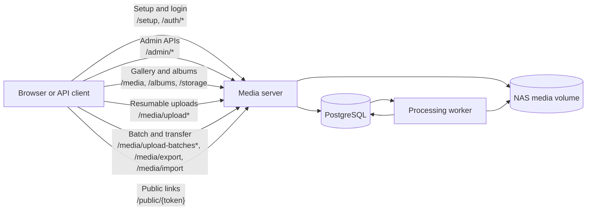
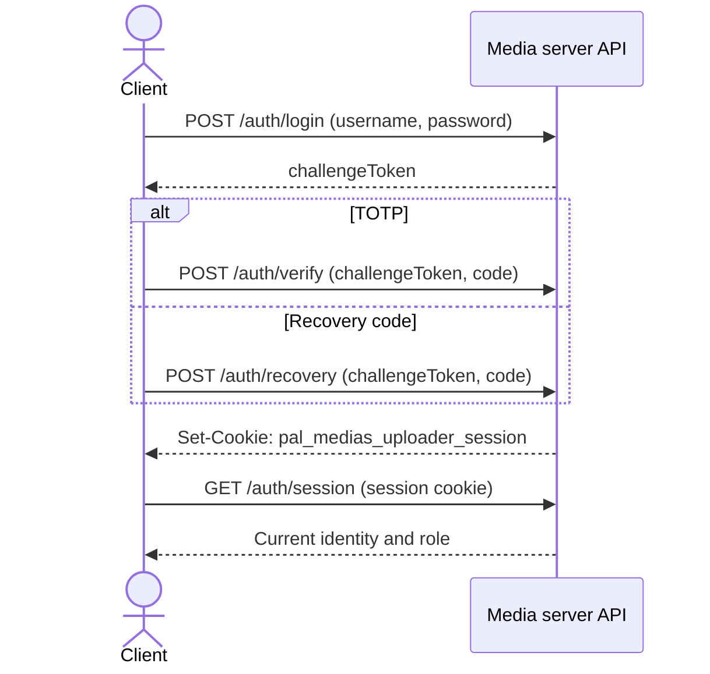
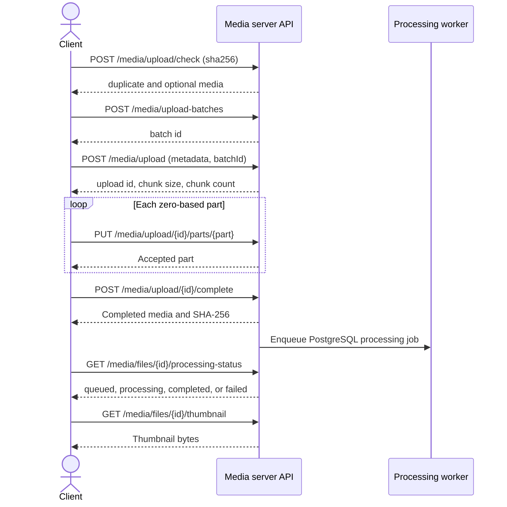
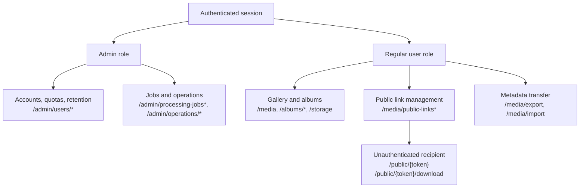

# Backend API reference

This backend supports multiple users, resumable media uploads, personal albums,
and owner-controlled sharing. Public URL names are an API contract; they do not
need to match Go package names.

## Domain ownership

<!-- markdownlint-disable MD013 -->

| Domain        | Responsibility                                                                 |
| ------------- | ------------------------------------------------------------------------------ |
| `setup`       | Bootstrap-authorized creation of the first persistent administrator.           |
| `auth`        | Login, TOTP verification, sessions, and logout.                                |
| `user`        | Accounts, roles, upload folders, downloads, and owner-managed shares.          |
| `uploader`    | Resumable upload sessions, chunks, completion, and cancellation.               |
| `autoalbum`   | Nightly weekly and high-volume daily album reconciliation.                     |
| `gallery`     | Albums, accessible media, personal favorites, trash, and storage totals.       |
| `moments`     | Time-session photo grouping, lifecycle, membership, and covers.                |
| `processing`  | Durable FFmpeg jobs, thumbnails, dimensions, duration, EXIF, and GPS metadata. |
| `publicshare` | Expiring, optionally password-protected public media and album links.          |
| `batch`       | Durable multi-file upload progress and cancellation.                           |
| `transfer`    | Versioned metadata export and manual-album import.                             |
| `trash`       | Per-user retention and scheduled physical-file cleanup.                        |
| `operations`  | Liveness, readiness, cleanup scheduling, and media integrity reporting.        |
| `db`          | PostgreSQL implementations of domain repository contracts.                     |

The domains share an authenticated user identity but do not call each other's
HTTP handlers. For example, `gallery` uses completed uploads as media records;
it does not implement file transfer again.

## Multi-user rules

- Every completed media item has one owner, assigned from the authenticated
  upload session. A client cannot choose `ownerId`.
- During an upgrade from the single-owner schema, startup migration assigns
  legacy media without an owner to the oldest administrator account. The
  migration then makes media ownership mandatory. Authenticated administrators
  may use gallery and download endpoints to access media assigned this way;
  upload and regular-user management workflows remain role-restricted.
- An owner may use an active item to share their library with another regular
  user. The recipient can access all current and future active media from that
  owner. Sharing grants list, album membership, favorite, download, storage,
  and automatic-album access; it does not transfer ownership.
- Albums belong to one user. A user may add owned media or media available
  through a library share. If a library share is removed, all media from that
  owner is no longer returned in the recipient's albums.
- Moments belong to one user and are stored separately from albums. Generation
  considers processed, active photos accessible to that user and never deletes
  or modifies source media.
- Public album links may contain only media owned by the link creator. Shared
  media can remain in private albums but is never exposed through those links.
- Favorite state belongs to `(user, media)`, so users do not overwrite each
  other's favorites.
- Only the owner may trash, restore, permanently delete, share, or unshare an
  item. Trashed media is immediately hidden from recipients.
- Permanent deletion stages the physical media file and generated thumbnail,
  deletes the database record, then removes the staged files. A database error
  restores both files before the request fails. Library-share relationships
  remain active for the owner's other current and future media.
- Resource lookups are scoped by the authenticated user. An inaccessible ID is
  reported as not found rather than exposing another user's data.

## Synology NAS quick install

This deployment uses Synology Container Manager and the published amd64/arm64
image. PostgreSQL data stays under `/volume1/docker/next-gallery-server`, while
media and incomplete uploads use separate bind mounts.

1. Install **Container Manager** from DSM Package Center and enable SSH
   temporarily in **Control Panel > Terminal & SNMP**.
2. Copy `build/compose.synology.yaml` onto the NAS, open an SSH session, and
  change to its parent repository directory.
3. Create the persistent directories:

```sh
mkdir -p /volume1/docker/next-gallery-server/{postgres,backups} \
  /volume1/media/{gallery,tmp}
```

1. Replace every `<change-me>` in `build/compose.synology.yaml`. Keep the
  PostgreSQL credentials in `ENV_DATABASE_URL` identical to the `postgres`
  service values. The bootstrap administrator password must be at least 12
  characters. Set `ENV_CORS_ALLOWED_ORIGINS` to the external HTTPS origin if
  DSM reverse proxy will be used.

1. Pull and start the Container Manager project:

```sh
docker compose -f build/compose.synology.yaml pull
docker compose -f build/compose.synology.yaml up -d
```

1. Wait for PostgreSQL and the media server to become healthy, then verify:

```sh
docker compose -f build/compose.synology.yaml ps
curl -fsS http://127.0.0.1:8013/readyz
```

1. Open `http://NAS-IP:8013/setup`, enter the bootstrap credentials from
  `build/compose.synology.yaml`, and create the permanent administrator.
  Enroll its TOTP token on first login. Then use `/admin/config` to create
  regular users.

The application container runs as a non-root user. Ensure the Container
Manager project has read/write permission to the three bind-mounted folders if
readiness reports a storage error. For HTTPS, configure DSM **Login Portal >
Advanced > Reverse Proxy**, forward to port `8013`, and set
`ENV_TRUSTED_PROXIES` to the DSM proxy source address or CIDR. Disable SSH again
after installation. Backup and restore procedures are documented in
[Synology deployment and operations](synology.md).

## Base URL and authentication

The default local URL is `http://127.0.0.1:8081`. `GET /` serves the gallery
application. The one-time `/setup` routes and the authentication routes are
public. All other routes require the `pal_medias_uploader_session` cookie.

Browser requests must include credentials:

```js
await fetch(`${baseUrl}/albums`, { credentials: "include" });
```

Administrators manage accounts and can use gallery routes, including access to
migrated legacy media, but cannot upload. Regular users can upload and use the
gallery. Accounts created by an administrator use password plus TOTP.
Environment bootstrap credentials authorize only the one-time setup form and
are never stored as a login account. The first persistent administrator enrolls
TOTP on first login.

`ENV_ADMIN_CONFIG=YES` serves the administrator account page at
`/admin/config`; `NO` makes only that page unavailable without disabling setup,
the gallery, or JSON APIs. `ENV_WEB_DIR` defaults to `./web/dist` and selects
the gallery production build.

## Endpoint summary

### Authentication and users

| Method  | Path                                | Access               | Purpose                                                       |
| ------- | ----------------------------------- | -------------------- | ------------------------------------------------------------- |
| `GET`   | `/setup`                            | Public, before setup | Open initial administrator setup.                             |
| `POST`  | `/setup`                            | Public, before setup | Create the first administrator.                               |
| `POST`  | `/auth/login`                       | Public               | Start password/TOTP login.                                    |
| `POST`  | `/auth/verify`                      | Public               | Verify TOTP and issue a session cookie.                       |
| `POST`  | `/auth/recovery`                    | Public               | Verify a single-use recovery code and issue a session cookie. |
| `GET`   | `/auth/session`                     | Authenticated        | Return the current identity and role.                         |
| `POST`  | `/auth/logout`                      | Authenticated        | Delete the current session.                                   |
| `POST`  | `/auth/recovery-codes`              | Authenticated        | Replace and return ten single-use recovery codes.             |
| `GET`   | `/admin/config`                     | Admin                | Open the account configuration page.                          |
| `GET`   | `/admin/users`                      | Admin                | List accounts.                                                |
| `POST`  | `/admin/users`                      | Admin                | Create an account and one-time TOTP setup.                    |
| `PATCH` | `/admin/users/{id}/password`        | Admin                | Reset a password and revoke that user's sessions.             |
| `PATCH` | `/admin/users/{id}/quota`           | Admin                | Set a per-user storage quota or use the default.              |
| `PATCH` | `/admin/users/{id}/trash-retention` | Admin                | Set a user's trash retention period.                          |
| `GET`   | `/admin/storage/dashboard`          | Admin                | Return per-user and total storage usage.                      |
| `GET`   | `/admin/processing-jobs`            | Admin                | List durable media-processing jobs.                           |
| `POST`  | `/admin/processing-jobs/{id}/retry` | Admin                | Retry a failed processing job.                                |
| `POST`  | `/admin/trash/cleanup`              | Admin                | Run expired-trash cleanup immediately.                        |
| `PUT`   | `/users/me/folder`                  | Regular user         | Change the user's upload folder.                              |
| `GET`   | `/media/app`                        | Regular user         | Open the embedded media workspace.                            |
| `GET`   | `/healthz`                          | Public               | Report process liveness.                                      |
| `GET`   | `/readyz`                           | Public               | Check PostgreSQL and filesystem reserve.                      |
| `GET`   | `/admin/operations/integrity`       | Admin                | Compare media records and filesystem files.                   |

## Client API flows

The browser or API client calls only the media server. Authenticated routes
use the `pal_medias_uploader_session` cookie; PostgreSQL and the media volume
are internal implementation details.



Password login returns a short-lived challenge. Complete it with either TOTP
or a previously generated single-use recovery code; the response sets the
session cookie used by subsequent calls.



A regular user can preflight a checksum, create a durable batch, and upload
each file in fixed-size parts. The processing status and thumbnail endpoints
become useful after completion enqueues the media job.



After login, clients can independently use the remaining API groups:



### Uploads

| Method   | Path                                | Purpose                                      |
| -------- | ----------------------------------- | -------------------------------------------- |
| `POST`   | `/media/upload/check`               | Check for owned media with the same SHA-256. |
| `POST`   | `/media/upload-batches`             | Create a durable multi-file batch.           |
| `GET`    | `/media/upload-batches/{id}`        | Get batch file and byte progress.            |
| `POST`   | `/media/upload-batches/{id}/cancel` | Cancel an active batch.                      |
| `POST`   | `/media/upload`                     | Create a resumable upload.                   |
| `GET`    | `/media/upload/{id}`                | List uploaded part numbers.                  |
| `PUT`    | `/media/upload/{id}/parts/{part}`   | Upload or replace one zero-based part.       |
| `POST`   | `/media/upload/{id}/complete`       | Verify and assemble completed media.         |
| `DELETE` | `/media/upload/{id}`                | Cancel an incomplete upload.                 |

Upload sessions belong to the user who created them. Parts use a fixed 8 MiB
size except for the final part. Incomplete sessions older than
`ENV_UPLOAD_RETENTION` are removed by the cleanup scheduler. See [the OpenAPI contract](../spec/openapi.yaml)
for complete request and response schemas.

### Media and sharing

| Method   | Path                                    | Access             | Purpose                                                          |
| -------- | --------------------------------------- | ------------------ | ---------------------------------------------------------------- |
| `GET`    | `/media`                                | Authenticated      | List active owned and shared media.                              |
| `GET`    | `/media?trash=true`                     | Authenticated      | List only the current user's trash.                              |
| `GET`    | `/media/files/{id}/download`            | Owner or recipient | Download active media.                                           |
| `GET`    | `/media/files/{id}/thumbnail`           | Owner or recipient | Download the generated thumbnail.                                |
| `GET`    | `/media/files/{id}/processing-status`   | Owner              | Get processing job status.                                       |
| `POST`   | `/media/files/{id}/shares`              | Owner              | Share all current and future media with `{ "username": "bob" }`. |
| `DELETE` | `/media/files/{id}/shares?username=bob` | Owner              | Remove Bob's library-wide access.                                |
| `PATCH`  | `/media/files/{id}/favorite`            | Owner or recipient | Set personal favorite state.                                     |
| `DELETE` | `/media/files/{id}`                     | Owner              | Move media to trash.                                             |
| `PATCH`  | `/media/files/{id}/restore`             | Owner              | Restore media from trash.                                        |
| `DELETE` | `/media/files/{id}/permanent`           | Owner              | Delete the file and database record.                             |
| `GET`    | `/storage`                              | Authenticated      | Return totals for accessible active media.                       |
| `POST`   | `/media/public-links`                   | Owner              | Link owned media or an album containing only owned media.        |
| `DELETE` | `/media/public-links/{id}`              | Owner              | Revoke a public link.                                            |
| `GET`    | `/public/{token}`                       | Public             | Inspect active public-link content.                              |
| `GET`    | `/public/{token}/download`              | Public             | Download linked media or an album ZIP.                           |
| `GET`    | `/media/export`                         | Regular user       | Export versioned media and album metadata.                       |
| `POST`   | `/media/import`                         | Regular user       | Import manual albums for currently owned media.                  |

`GET /media` supports `search`, `kind=photo|video`,
`sort=newest|oldest|title`, `trash=true`, capture-time ranges, and GPS radius
search. A returned item's `shared` field is `true` when the current user is a
recipient rather than its owner.

### Albums

| Method   | Path                           | Purpose                                   |
| -------- | ------------------------------ | ----------------------------------------- |
| `GET`    | `/albums`                      | List the current user's albums.           |
| `POST`   | `/albums`                      | Create an album.                          |
| `PATCH`  | `/albums/order`                | Set album display order.                  |
| `GET`    | `/albums/{albumId}`            | Get an album and accessible active media. |
| `PATCH`  | `/albums/{albumId}`            | Update title and description.             |
| `DELETE` | `/albums/{albumId}`            | Delete the album, not its media.          |
| `POST`   | `/albums/{albumId}/media`      | Add owned or shared media.                |
| `DELETE` | `/albums/{albumId}/media/{id}` | Remove media from the album.              |
| `PATCH`  | `/albums/{albumId}/cover`      | Set an accessible album member as cover.  |

<!-- markdownlint-enable MD013 -->

Automatic albums are reconciled once per night. The default is `02:00` in the
server's local timezone; configure `ENV_AUTO_ALBUM_RUN_AT` with a `HH:MM` value
and `ENV_AUTO_ALBUM_TIMEZONE` with an IANA timezone such as
`Europe/Stockholm`. A restart does not run the job immediately; the next
configured nightly run processes media that still has no automatic album.

Grouping uses each owner's completed media and UTC calendar dates. Weeks run
Monday through Sunday. A normal week is titled like `October 5 - 11`. When one
date has more than 15 uploads, reconciliation creates a daily album such as
`October 5` and moves all uploads from that date out of the weekly album. Later
unassigned uploads on that date go directly to the daily album.

Responses mark these albums with `"automatic": true`. Their title, order,
membership, and lifecycle are system-managed, so the manual update, delete,
reorder, add, and remove operations return `404` for them. Users may still
select an album cover.

### Moments

<!-- markdownlint-disable MD013 MD060 -->

| Method   | Path                                  | Purpose                                      |
| -------- | ------------------------------------- | -------------------------------------------- |
| `GET`    | `/moments`                            | List the current user's moments.             |
| `POST`   | `/moments/generate`                   | Group currently unassigned processed photos. |
| `GET`    | `/moments/{momentId}`                 | Get a moment and its photos.                 |
| `PATCH`  | `/moments/{momentId}`                 | Edit metadata and lifecycle.                 |
| `DELETE` | `/moments/{momentId}`                 | Delete the moment, not its photos.            |
| `POST`   | `/moments/{momentId}/media`           | Add accessible photos.                       |
| `DELETE` | `/moments/{momentId}/media/{mediaId}` | Remove a photo, retaining at least one.       |
| `PATCH`  | `/moments/{momentId}/cover`           | Select a member as the cover.                 |

<!-- markdownlint-enable MD013 MD060 -->

Initial generation considers successfully processed photos captured within the
previous seven days, falling back to upload time, then groups adjacent photos
whose gap is at most 30 minutes. Groups must contain at least three photos.
Qwen evaluates images sampled across each group and generates its title and
description; the group becomes a draft only when at least 65% of those images
support one shared description. Already assigned photos are skipped on later
runs, and the database prevents a photo from belonging to multiple Moments.
Manual edits set a durable flag so later reconciliation cannot silently replace
user choices.

Background generation runs every 168 hours by default. Set
`ENV_MOMENTS_INTERVAL` to another positive Go duration such as `24h` or `336h`.
Set `ENV_MOMENTS_QWEN_URL` to the Ollama endpoint and
`ENV_MOMENTS_QWEN_MODEL` to the installed vision model, such as
`qwen3-vl:4b`.

Create or update an album:

```json
{
  "title": "Summer holiday",
  "description": "Coast and mountains"
}
```

Add media:

```json
{
  "mediaIds": ["4c159d2d679c4469b6c51e061f723034"]
}
```

## Processing boundary

Thumbnail and metadata extraction are intentionally asynchronous. Completing
an upload creates a PostgreSQL-backed processing job; the in-process worker
uses FFmpeg and FFprobe and persists its progress across container restarts.
Failed work is requeued with a bounded backoff, and jobs left in `processing`
for 15 minutes are eligible to be reclaimed after a worker interruption.
The gallery remains responsible for access and presentation, while processing
owns generated thumbnails, dimensions, duration, capture time, EXIF, and GPS.
Filesystem integrity scanning ignores the managed `.thumbnails` tree, remains
an administrator operation, and never imports unowned files automatically.

## Errors

JSON errors use an `error` field:

```json
{ "error": "not found" }
```

Common statuses are `400` for invalid input, `401` for a missing or invalid
session, `403` for the wrong role, `404` for missing or inaccessible resources,
`409` for missing upload parts or duplicate media, `500` for internal failures,
and `502` when a physical file cannot be deleted.
