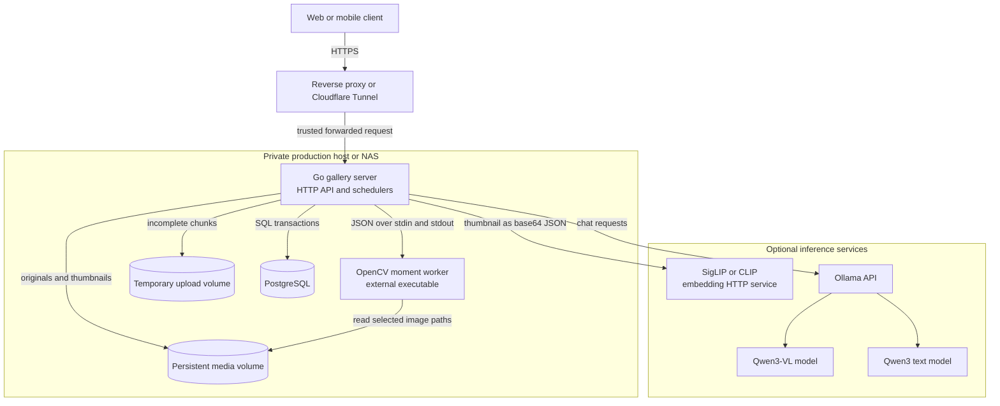
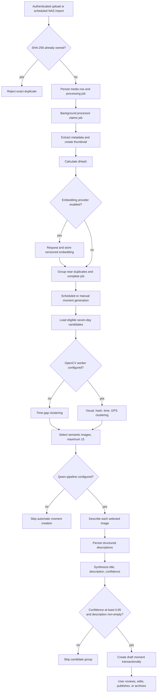
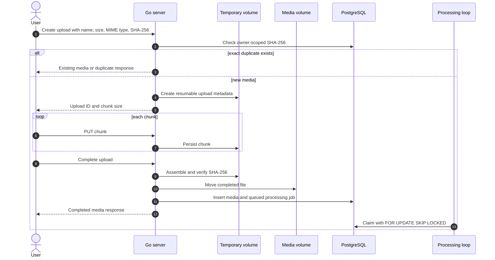
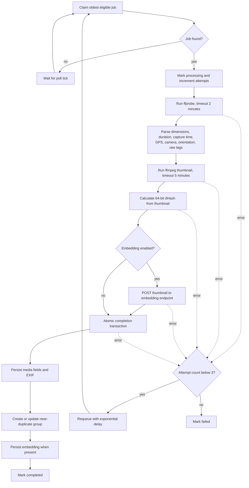
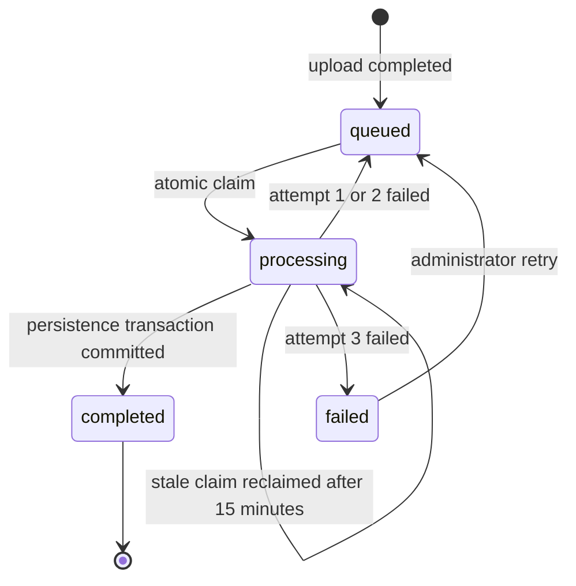
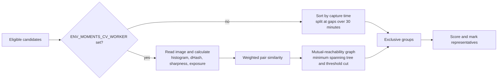
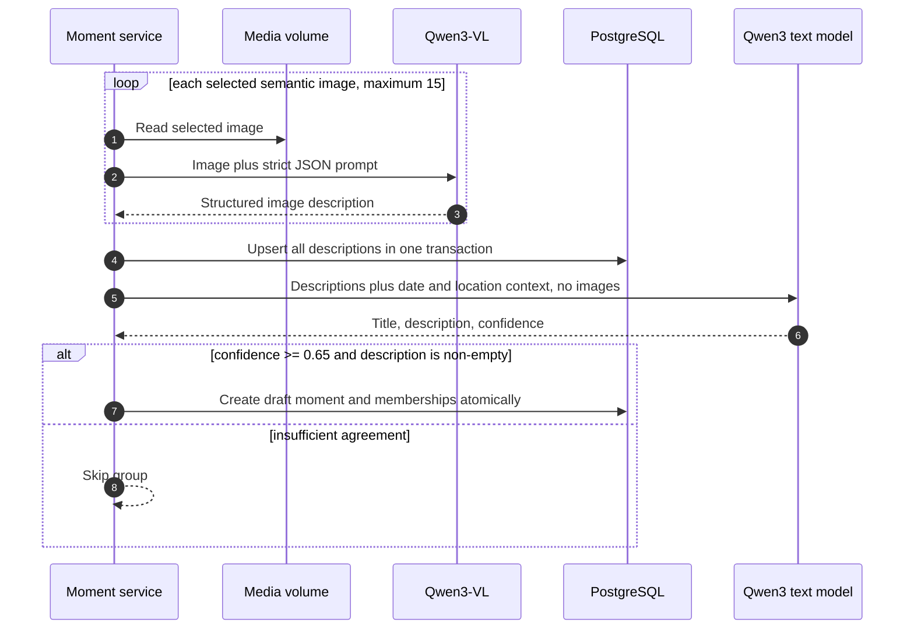
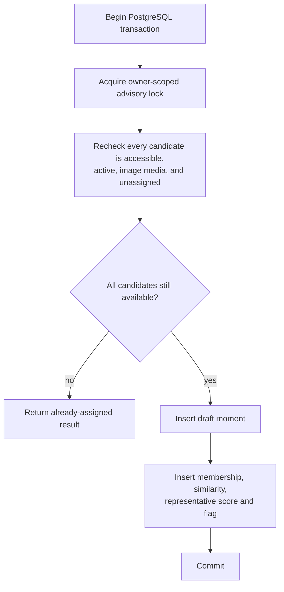
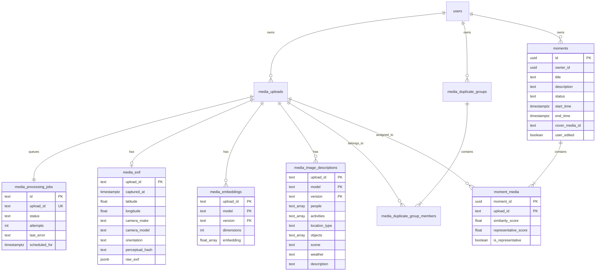

# Photo Moments: Production Architecture and Flow

## 1. Purpose

This document describes how photo moments are created, stored, operated, and scaled in production. It reflects the server implementation validated on **2026-10-09**.

The pipeline is local-first:

- Original media remains in the configured media filesystem.
- PostgreSQL stores metadata, processing state, duplicate groups, embeddings, image descriptions, moments, and memberships.
- Deterministic processing handles metadata, hashing, duplicate detection, clustering, and representative selection.
- Optional model services add image embeddings and semantic descriptions.
- No stage deletes or modifies an original media file.

The generated domain object is a **moment**. Albums are a separate curated or calendar-based feature.

## 2. Production Status

| Capability                               | Status                   | Production behavior                                                                                                        | Follow-up                                                           |
| ---------------------------------------- | ------------------------ | -------------------------------------------------------------------------------------------------------------------------- | ------------------------------------------------------------------- |
| Resumable upload                         | Implemented              | Authenticated chunked uploads are assembled, SHA-256 verified, and persisted                                               | None for the moment pipeline                                        |
| Processing queue                         | Implemented              | PostgreSQL queue with atomic claims, stale-claim recovery, retries, and manual retry                                       | Add metrics and dead-letter alerting                                |
| Metadata and thumbnails                  | Implemented              | `ffprobe` extracts technical metadata and `ffmpeg` creates bounded JPEG thumbnails                                         | Physically rotate pixels if a consumer ignores orientation metadata |
| Exact duplicates                         | Implemented              | Owner-scoped SHA-256 checks reject duplicate upload creation                                                               | Add a retain-and-review mode if desired                             |
| Near duplicates                          | Implemented              | Persisted dHash values create owner-scoped groups at Hamming distance `<= 5`                                               | Add duplicate review UI                                             |
| Image embeddings                         | Optional                 | An HTTP provider returns versioned vectors stored in PostgreSQL                                                            | Add an ANN index when bounded scans are insufficient                |
| Visual clustering                        | Optional                 | The production image packages an OpenCV executable that performs similarity scoring and mutual-reachability MST clustering | Consider canonical HDBSCAN if needed                                |
| Temporal clustering fallback             | Implemented              | Without the OpenCV worker, candidates are split at 30-minute gaps                                                          | This is less accurate than the full profile                         |
| Representative selection                 | Implemented in CV worker | Centrality, sharpness, exposure, and diversity select 1 to 15 images                                                       | Tune weights against labeled collections                            |
| Structured image descriptions            | Optional                 | Qwen-VL describes each selected semantic image and results are persisted                                                   | Add explicit prompt/schema version values                           |
| Metadata synthesis                       | Optional                 | A separate Qwen3 text request creates title, description, and confidence                                                   | Add independent retryable AI jobs                                   |
| Moment persistence                       | Implemented              | Advisory locking and one transaction prevent duplicate ownership assignment                                                | None                                                                |
| Deterministic moment creation without AI | Gap                      | The server runs without AI, but automatic moment creation currently skips groups when no enricher is configured            | Add deterministic title/description fallback                        |

### Important deployment reality

The production image builds the OpenCV worker with CGO and exposes it at `/app/moments-cv-worker`. Both Compose files configure that path and initialize the Qwen vision and text models before starting the server.

The embedding provider remains a separate HTTP service and is not included in either Compose file. Leave `ENV_MOMENTS_EMBEDDING_URL` empty to use histogram similarity, or configure a compatible private endpoint to enable versioned SigLIP/CLIP vectors.

## 3. Production Profiles

### 3.1 Core profile

Components:

- Go server
- PostgreSQL
- Persistent media and temporary-upload volumes
- `ffprobe` and `ffmpeg` in the server image

Behavior:

- Upload, metadata extraction, thumbnail generation, dHash, near-duplicate grouping, gallery access, and manual moment management work.
- Candidate grouping falls back to time-only clustering.
- Automatic moment generation does not create moments without AI enrichment.

### 3.2 Full local intelligence profile

Adds:

- OpenCV moment worker built with `-tags opencv`
- SigLIP/CLIP-compatible embedding HTTP service
- Ollama or compatible `/api/chat` endpoint
- Qwen3-VL vision model
- Qwen3 text model

This profile activates the complete flow documented below.

### 3.3 External inference profile

The embedding and Qwen endpoints may run on another trusted machine or a temporary GPU host. Only thumbnails or selected semantic images should leave the media host. TLS, authentication, retention controls, and audit logging are deployment responsibilities because the current provider clients do not add service authentication themselves.

## 4. Production Deployment Topology



### Ownership boundaries

| Component         | Owns                                                               | Must not own            |
| ----------------- | ------------------------------------------------------------------ | ----------------------- |
| Go server         | HTTP, authentication, scheduling, orchestration, filesystem safety | Long-term model state   |
| PostgreSQL        | Durable metadata, queues, relations, generated records             | Original media bytes    |
| Media volume      | Original files and generated thumbnails                            | Queue state             |
| OpenCV worker     | Per-run features, clustering, representative scores                | Durable records         |
| Embedding service | Vector inference                                                   | Photo persistence       |
| Qwen service      | Structured visual and text inference                               | Permanent photo storage |

## 5. End-to-End Production Flow



## 6. Upload and Queue Sequence



Uploads are resumable across server restarts because temporary upload metadata and chunks are stored below `ENV_TMP_DIR`. Completed media paths are relative to `ENV_MEDIA_DIR`; path traversal is rejected before processing or inference.

## 7. Media Preprocessing

### 7.1 Worker behavior

The processing loop runs inside the Go server and polls every five seconds when there is no immediately available job.



### 7.2 Processing state machine



Retries use increasing delays derived from the attempt count. Administrators can inspect the latest 200 jobs and manually requeue failed jobs.

### 7.3 Near-duplicate policy

For each completed item, the transaction finds the nearest dHash among the same owner's active media. A distance of five bits or fewer creates or extends a near-duplicate group. The first image is the primary; subsequent members are excluded from automatic moment candidates. No file is deleted.

## 8. Candidate Selection and Clustering

### 8.1 Candidate eligibility

A photo is eligible only when all conditions hold:

- It is an image and is not in trash.
- Its processing job is completed.
- Its capture or upload timestamp is within the previous seven days and not in the future.
- The requesting owner owns it or has library-level shared access.
- It is not a non-primary near duplicate.
- It is not already assigned to one of that owner's moments.

### 8.2 Clustering modes



The OpenCV worker receives candidate JSON on standard input and returns group JSON on standard output. The server rejects unknown, duplicate, or omitted candidate IDs before accepting the result.

### 8.3 Similarity model

When embeddings exist for both images, cosine similarity is the visual signal. Otherwise the color-histogram intersection is used.

$$
S = 0.55S_{visual} + 0.20S_{dHash} + 0.15S_{time} + 0.10S_{location}
$$

Current limits:

- Time similarity decays to zero over six hours.
- Location similarity decays to zero over 50 km.
- Missing GPS contributes a neutral `0.5` location similarity.
- MST edges are retained at similarity `>= 0.62`.

The implementation borrows the mutual-reachability and MST construction used by density clustering, but it is not canonical HDBSCAN: it does not build a condensed hierarchy, calculate cluster stability, assign soft membership, or emit an explicit noise label.

### 8.4 Representative selection

Quality score:

$$
Q = 0.45S_{centrality} + 0.35S_{sharpness} + 0.20S_{exposure}
$$

Iterative selection balances quality and novelty:

$$
R = 0.65Q + 0.35S_{diversity}
$$

Selection count:

- Empty group: zero.
- Fewer than five images: one.
- Five or more: $\lceil\sqrt{n}\rceil$, clamped to 5 through 15 and never greater than the group size.

## 9. Semantic Enrichment

Groups smaller than three are ignored. For larger groups, representatives are selected first, then timeline samples fill any remaining semantic slots up to 15 images.



### 9.1 Per-image contract

```json
{
  "people": ["two children"],
  "activities": ["playing"],
  "location_type": "park",
  "objects": ["ball", "trees"],
  "scene": "outdoor",
  "weather": "sunny",
  "description": "Two children playing with a ball in a park."
}
```

The vision prompt requires visible evidence only. Unknown details must be empty, and the model must not identify people or invent dates, places, activities, or weather.

### 9.2 Synthesis contract

```json
{
  "title": "An Afternoon in the Park",
  "description": "Children play outdoors in a tree-lined park.",
  "confidence": 0.87
}
```

The text request contains no images. Confidence is normalized to `0..1`; values from `1..100` are accepted and divided by 100 for provider compatibility.

### 9.3 Failure behavior

- If any image description fails, that group is skipped for the current run.
- Descriptions are committed before text synthesis. A synthesis failure leaves reusable descriptions but does not create a partial moment.
- Model failures are logged and processing continues with the next group.
- AI requests do not currently have their own durable queue or retry policy.

## 10. Transactional Moment Creation



The advisory lock serializes generation per owner. Manual edits set `user_edited = true`; title, description, status, membership, and cover remain user-controlled through authenticated endpoints.

## 11. Data Model



## 12. Scheduling and Triggers

| Trigger           | Default                             | Behavior                                          |
| ----------------- | ----------------------------------- | ------------------------------------------------- |
| Processing worker | Continuous                          | Drains queued jobs; waits five seconds when idle  |
| Moment generation | Every `168h`                        | Runs for all users after each interval tick       |
| Manual generation | `POST /moments/generate`            | Runs immediately for the authenticated owner      |
| Automatic albums  | Daily at `02:00` local time         | Separate feature; reconciles albums, not moments  |
| NAS import        | Same daily schedule when configured | Discovers imported media before normal processing |
| Cleanup           | Every `1h`                          | Cleans expired sessions and abandoned uploads     |

The moment scheduler does not run immediately at startup. Operators can use the manual endpoint for an initial run or wait for the first interval.

## 13. Runtime Configuration

### Required core settings

| Variable             | Purpose                               |
| -------------------- | ------------------------------------- |
| `ENV_DATABASE_URL`   | PostgreSQL connection URL             |
| `ENV_MEDIA_DIR`      | Persistent originals and thumbnails   |
| `ENV_TMP_DIR`        | Resumable upload state and chunks     |
| `ENV_PORT`           | HTTP listen port                      |
| `ENV_ADMIN_USERNAME` | One-time setup authorization username |
| `ENV_ADMIN_PASSWORD` | One-time setup authorization password |

### Moment pipeline settings

| Variable                      | Default       | Effect when empty                                       |
| ----------------------------- | ------------- | ------------------------------------------------------- |
| `ENV_MOMENTS_INTERVAL`        | `168h`        | Invalid or non-positive values stop startup             |
| `ENV_MOMENTS_CV_WORKER`       | empty         | Uses temporal clustering                                |
| `ENV_MOMENTS_EMBEDDING_URL`   | empty         | Skips embeddings; CV falls back to histogram similarity |
| `ENV_MOMENTS_EMBEDDING_MODEL` | `siglip`      | Sent to the embedding provider                          |
| `ENV_MOMENTS_QWEN_URL`        | empty         | Automatic moment creation is skipped                    |
| `ENV_MOMENTS_QWEN_MODEL`      | `qwen3-vl:4b` | Vision model identifier                                 |
| `ENV_MOMENTS_QWEN_TEXT_MODEL` | `qwen3:4b`    | Text synthesis model identifier                         |

### Fixed algorithm values

These values are currently compile-time constants:

| Setting                       | Value      |
| ----------------------------- | ---------- |
| Candidate window              | 7 days     |
| Temporal fallback gap         | 30 minutes |
| Minimum group size            | 3 images   |
| Maximum semantic images       | 15         |
| Minimum synthesis confidence  | 0.65       |
| Near-duplicate dHash distance | 5 bits     |
| CV similarity threshold       | 0.62       |

## 14. Production Deployment Checklist

### Storage and database

- Mount `ENV_MEDIA_DIR`, `ENV_TMP_DIR`, and PostgreSQL data on persistent storage.
- Back up PostgreSQL and media together to preserve referential consistency.
- Verify the server user can read and write mounted media directories.
- Keep PostgreSQL off the public network.
- Test restore procedures, not only backup creation.

### Full intelligence profile

- Verify `/app/moments-cv-worker` starts in the production image and `ENV_MOMENTS_CV_WORKER` points to it.
- Ensure the worker can read the same media paths as the server.
- Deploy the embedding endpoint before setting `ENV_MOMENTS_EMBEDDING_URL`.
- Pull both the vision and text Qwen models.
- Confirm the server can reach model services over a private network.
- Run one manual generation request before relying on the weekly scheduler.

### Security and privacy

- Terminate TLS at a trusted reverse proxy.
- Set `ENV_TRUSTED_PROXIES` only to known proxy CIDRs.
- Restrict CORS to deployed frontend origins.
- Replace all example credentials and tunnel tokens.
- Keep inference services private; do not expose Ollama directly to the public internet.
- Treat thumbnails, embeddings, and descriptions as personal data.
- If inference leaves the host, define deletion, retention, and audit policies.
- Do not log image payloads, credentials, TOTP secrets, or raw model requests.

### Availability

- Gate server startup on PostgreSQL readiness.
- Monitor `/healthz` for liveness and `/readyz` for dependency readiness.
- Use a restart policy such as `unless-stopped`.
- Configure JSON log rotation.
- Alert on repeated processing failures and model endpoint errors.

## 15. Observability

The server currently emits structured JSON logs. Production monitoring should derive or add metrics for:

- Uploads created, completed, rejected, and abandoned.
- Processing queue depth by status.
- Oldest queued job age.
- Processing duration and attempts.
- Metadata, thumbnail, embedding, CV, vision, and synthesis failures.
- Near-duplicate groups and excluded candidates.
- Candidates loaded, groups formed, and groups below minimum size.
- Model request duration and response-validation failures.
- Moments created, skipped for confidence, or skipped as already assigned.
- Scheduler run duration and last successful completion.
- Media, temporary-volume, and PostgreSQL disk utilization.

Recommended alerts:

| Condition                       | Initial threshold                                     |
| ------------------------------- | ----------------------------------------------------- |
| Failed processing jobs          | Any sustained increase                                |
| Oldest queued job               | Older than 30 minutes                                 |
| Readiness failure               | Two consecutive checks                                |
| Model endpoint failure rate     | More than 10% over 15 minutes                         |
| Moment scheduler                | No successful run for twice the configured interval   |
| Free media or temporary storage | Below `ENV_MIN_DISK_FREE_BYTES` plus operating margin |

## 16. Scaling Model

### Current safe scale-out

- PostgreSQL queue claims use `FOR UPDATE SKIP LOCKED`, so multiple processing loops can claim different jobs safely.
- Moment persistence uses an owner-scoped advisory transaction lock, preventing concurrent generators from assigning the same candidates for one owner.
- Shared server replicas require the same media and temporary filesystems.

### Current bottlenecks

- Near-duplicate matching scans existing owner hashes during completion.
- Embeddings are stored as arrays without an ANN index.
- The OpenCV command loads and compares the complete seven-day candidate set for an owner in one process.
- Image descriptions are requested sequentially.
- AI calls happen synchronously inside a moment-generation run.
- Moment scheduling is in-process; multiple server replicas may start the same generation run, although database locking protects final assignment.

### Scale-out path

1. Separate API and background-worker process roles.
2. Put preprocessing, embedding, description, and synthesis in explicit durable job types.
3. Add scheduler leadership or an external scheduler.
4. Add bounded concurrency and provider rate limits.
5. Introduce pgvector or another ANN index only when measured candidate volume requires it.
6. Partition clustering by owner and bounded time window.

## 17. Failure and Recovery Matrix

| Failure                                        | Current result                                  | Recovery                                                           |
| ---------------------------------------------- | ----------------------------------------------- | ------------------------------------------------------------------ |
| Server restarts during upload                  | Chunks and metadata remain in temporary storage | Resume upload before retention cleanup                             |
| Server restarts during processing              | A job may remain `processing`                   | Reclaimed after 15 minutes                                         |
| `ffprobe`, `ffmpeg`, dHash, or embedding fails | Job retries, then becomes failed on attempt 3   | Fix dependency and use admin retry                                 |
| OpenCV worker exits or returns invalid IDs     | Current moment run fails for the owner          | Fix worker and rerun generation                                    |
| One vision request fails                       | Current group is skipped                        | Rerun generation; no durable AI retry yet                          |
| Text synthesis fails                           | Descriptions remain, no moment is created       | Rerun generation                                                   |
| Confidence below 0.65                          | Group is intentionally skipped                  | Tune model/prompt or review threshold in code                      |
| Concurrent assignment wins elsewhere           | Transaction returns already assigned            | No action required                                                 |
| PostgreSQL unavailable                         | Readiness and database operations fail          | Restore database connectivity; durable state remains in PostgreSQL |
| Media path missing                             | Processing or enrichment fails                  | Restore file or repair the database/file relationship              |

## 18. API Surface for Moments

All routes require an authenticated session.

| Method   | Route                                | Purpose                                           |
| -------- | ------------------------------------ | ------------------------------------------------- |
| `GET`    | `/moments`                           | List the current user's moments                   |
| `POST`   | `/moments/generate`                  | Run generation immediately for the current user   |
| `GET`    | `/moments/:id`                       | Get a moment and ordered media                    |
| `PATCH`  | `/moments/:id`                       | Update title, description, or status              |
| `DELETE` | `/moments/:id`                       | Delete the moment, not its media                  |
| `POST`   | `/moments/:id/media`                 | Add accessible image media                        |
| `DELETE` | `/moments/:id/media/:mediaID`        | Remove media while preserving at least one member |
| `PATCH`  | `/moments/:id/cover`                 | Select a member as cover                          |
| `GET`    | `/media/files/:id/processing-status` | Read media processing status                      |
| `GET`    | `/admin/processing-jobs`             | Inspect recent jobs as an administrator           |
| `POST`   | `/admin/processing-jobs/:id/retry`   | Retry a failed processing job                     |

## 19. Acceptance Checks

Before enabling scheduled generation in production, verify:

1. A resumable upload survives a server restart and completes with the expected SHA-256.
2. A completed image produces dimensions, a thumbnail, EXIF data, and dHash.
3. A failed processing dependency reaches `failed` after three attempts and an administrator can retry it.
4. Near-duplicate secondary images are absent from candidate queries.
5. Embeddings persist with model, version, dimensions, and vector when enabled.
6. The OpenCV worker returns every candidate exactly once and chooses expected representatives on a labeled fixture.
7. Vision inference receives one selected image per request.
8. Text synthesis receives descriptions and no image payload.
9. Low-confidence output does not create a moment.
10. Concurrent generation does not assign one photo twice for the same owner.
11. User edits set `user_edited` and remain authoritative.
12. Backup restoration recovers media, processing state, descriptions, moments, and memberships consistently.

Repository validation commands:

```bash
go test ./...
go test -tags opencv ./app/processing ./app/db ./app/moments ./cmd/moments-cv-worker ./cmd/server
```

## 20. Roadmap

### Production hardening

1. Package the OpenCV worker and required native libraries in a production image or dedicated worker image.
2. Pull and health-check both configured Qwen models in deployment manifests.
3. Add a durable queue for image descriptions and text synthesis.
4. Add deterministic moment metadata when AI is disabled.
5. Add metrics, traces, scheduler-run records, and operational dashboards.
6. Persist explicit prompt and schema versions for image descriptions.

### Product capabilities

1. Add near-duplicate review and user decisions.
2. Add local reverse geocoding and location names.
3. Add merge and split workflows for generated moments.
4. Add semantic search over embeddings and descriptions.
5. Add opt-in face or person grouping with biometric-data controls.
6. Add periodic full reconciliation in addition to incremental generation.

### Algorithm evolution

1. Make weights and thresholds configurable and versioned.
2. Build a labeled evaluation set for grouping and representative quality.
3. Evaluate canonical HDBSCAN only if hierarchy stability, explicit noise, or soft membership improves measured outcomes.
4. Add embedding indexes only after query measurements justify the operational cost.

## 21. Invariants

The production implementation must preserve these rules:

1. Original media is never modified or automatically deleted.
2. Exact and near duplicates are owner-scoped.
3. Media access is checked against ownership or explicit sharing.
4. Filesystem paths cannot escape configured roots.
5. A photo belongs to at most one generated moment per owner.
6. AI output is validated before persistence.
7. Low-confidence semantic output cannot create a moment.
8. User edits are explicit and must not be silently overwritten.
9. External inference is optional configuration, not a prerequisite for upload, storage, gallery access, or deterministic preprocessing.
10. Deployment documentation must distinguish configured capability from code that merely exists in the repository.
