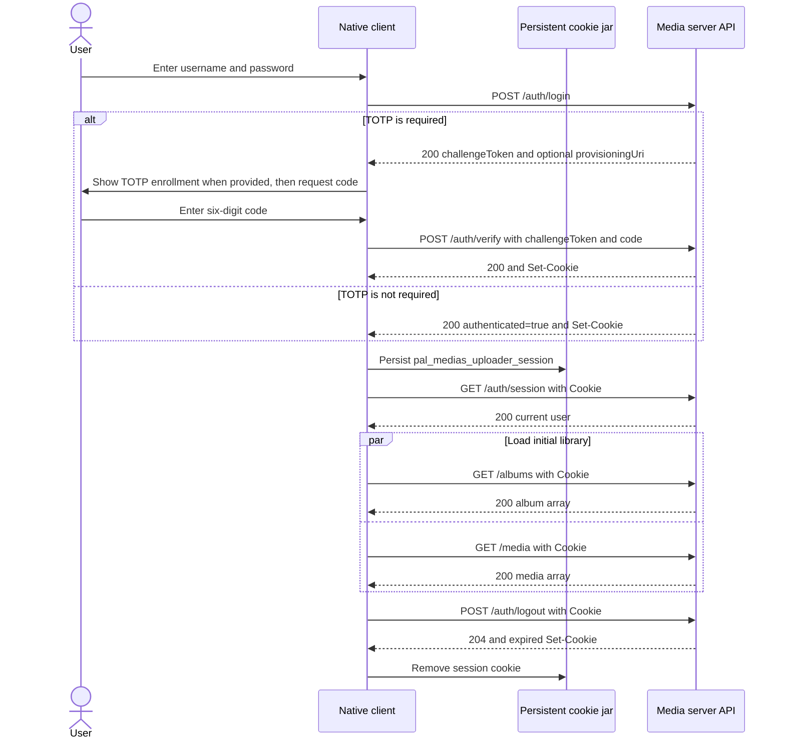

# Useful features

The NAS media server includes the following optional workflows. All management
endpoints require the existing session cookie. User endpoints require the
`user` role; `/admin` endpoints require `admin`.

## API client authentication lifecycle

The API uses a server-side session identified by the
`pal_medias_uploader_session` cookie. It does not return a bearer token after
login. Browser clients handle this cookie automatically when credentials are
enabled. Native clients, including Android applications, must use a persistent
cookie jar that accepts `Set-Cookie` response headers and adds the matching
cookie to later requests.

A client should implement the following user journey:

1. Send `POST /auth/login` with `username` and `password` as JSON.
2. If the response has `authenticated: true`, login is complete and the
   response already contains the session `Set-Cookie` header. This path is
   used only for an account that does not require TOTP.
3. Otherwise, retain the returned `challengeToken`. On a user's first TOTP
   login, also show the returned `provisioningUri` or `secret` so the user can
   add the account to an authenticator application. The challenge expires
   after five minutes.
4. Ask the user for the current six-digit code and send `POST /auth/verify`
   with `challengeToken` and `code`. Do not start authenticated API requests
   until this response succeeds and its `Set-Cookie` header has been saved by
   the cookie jar.
5. Optionally call `GET /auth/session` to confirm the session and retrieve the
   user's `id`, `username`, and `role`.
6. Send the stored `pal_medias_uploader_session` cookie on every protected
   request, such as `GET /albums`, `GET /media`, and `GET /storage`.
7. On `401 Unauthorized`, discard the local session state and return the user
   to login. The cookie may be missing, expired, invalid, or no longer backed
   by a server session.
8. To sign out, send `POST /auth/logout` with the current cookie, then remove
   it from the cookie jar. The response expires the cookie and deletes the
   server-side session.

For a new user with no albums or media, `GET /albums` and `GET /media` return
`200 OK` with `[]`; `GET /storage` returns zero totals. Clients should treat
these as valid empty states, not as authentication or server errors. A `500`
is not an expected empty-library response: record the failing method, path,
response body, and server log before retrying. A `401` immediately after a
successful TOTP verification usually means the native client did not retain
or resend the session cookie.

The session cookie is HTTP-only, applies to `/`, and has a 30-day lifetime.
When the server is reached over HTTPS, clients must honor its `Secure`
attribute and continue using HTTPS. Cookie matching still follows the request
host, path, and scheme, so changing between a hostname and an IP address can
prevent a stored cookie from being sent.

## Uploads and processing

- `POST /media/upload/check` checks an owner-scoped SHA-256 digest before
  uploading.
- `POST /media/upload-batches` creates a durable batch. Include its returned
  `id` as `batchId` in the existing `POST /media/upload` request. The embedded
  workspace performs duplicate checks first, so batch file and byte totals
  include only files that will be uploaded.
- `GET /media/upload-batches/{id}` reports completed files and bytes. `POST
/media/upload-batches/{id}/cancel` prevents new or late completions.
- Completed uploads enqueue a PostgreSQL-backed FFmpeg job. `GET
/media/files/{id}/processing-status` reports progress. Failed jobs are retried,
  and interrupted jobs are reclaimed after 15 minutes in `processing`.
- Generated thumbnails are available at `GET /media/files/{id}/thumbnail`.
  Gallery records include dimensions, duration, capture time, and GPS
  coordinates when found. Permanent deletion removes both the original media
  and its generated thumbnail.
- Gallery filters accept `capturedAfter`, `capturedBefore` (RFC3339),
  `latitude`, `longitude`, and `radiusKm`.

## Accounts and storage

- `POST /auth/recovery-codes` replaces and returns ten single-use TOTP recovery
  codes. Store them immediately; only digests are retained.
- `POST /auth/recovery` accepts the normal `challengeToken` plus a recovery
  `code` after password verification.
- `PATCH /admin/users/{id}/password` resets a password and revokes that user's
  sessions.
- `GET /admin/storage/dashboard` reports per-user usage. `PATCH
/admin/users/{id}/quota` sets `storageQuotaBytes` or `null` for the
  environment default.
- `PATCH /admin/users/{id}/trash-retention` sets `days` from 1 through 3650.
  Cleanup runs every six hours and can be triggered with `POST
/admin/trash/cleanup`.

## Sharing and transfer

- `POST /media/public-links` creates an expiring media or album link with an
  optional password. Send `mediaId` or `albumId`, `expiresAt`, and optional
  `password`. Public album links are accepted only when every album item is
  owned by the link creator; privately shared media is never re-shared.
- Public consumers use `GET /public/{token}` and `GET
/public/{token}/download`. Passwords are supplied in `X-Share-Password`;
  three failed attempts lock that link/client pair for five minutes.
- Owners revoke links with `DELETE /media/public-links/{id}`.
- `GET /media/export` downloads versioned JSON metadata. `POST /media/import`
  restores manual albums and only associates media currently owned by the
  importer.

## Embedded pages

- `/media/app` is the mobile-friendly media workspace with multi-file resumable
  upload, duplicate preflight, batch progress, thumbnails, import/export,
  recovery codes, and public-link creation.
- `/admin/config` includes storage usage, quotas, password resets, and trash
  retention controls.

The processing worker and trash scheduler run inside the single application
instance. PostgreSQL keeps queue and progress state across container restarts;
Redis is not required.
